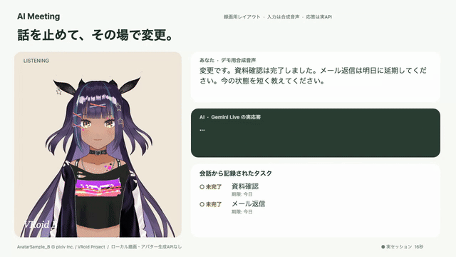

# AI Meeting

**会話で決めたTODOを、次回へ残す。**

会話をTODOへ変える、オープンソースの**voice-to-task**アプリです。割り込み可能な音声AI、VRMアバター、ブラウザー内のタスク保存を試せます。

「資料確認は今日中に。メール返信は明日に」。AIキャラクターに話し、途中で言い直し、タスクを追加・完了・延期。聞き取りの確認が必要な変更は、内容を確かめてから保存します。

[登録せずタスクを試す](https://ai-meeting.web.app/#tasks) · [VRMアバターを試す](https://ai-meeting.web.app/vrm-demo) · [45秒の操作デモ](https://youtu.be/qLenE6R7-nI) · [GitHubでStarする](https://github.com/FORIFOR/AI-meeting) · [有料の導入・カスタマイズ相談](https://ai-meeting.forifor.chatgpt.site/ja#business) · [質問・利用例を共有](https://github.com/FORIFOR/AI-meeting/discussions) · [English](README.md)

[](https://youtu.be/qLenE6R7-nI)

*入力は日本語の合成音声、返答は実際のGemini。録画用レイアウトを使い、入力と一致する提案をスクリプトで確認して反映しています。[録画方法と検証範囲](docs/validation.md)。*

*README内のプレビューは録画フローの8秒抜粋です。全体の操作は45秒のデモで確認できます。*

## インストール前に試す

| 入口 | できること・条件 |
| --- | --- |
| [タスクをひとつ保存する](https://ai-meeting.web.app/#tasks) | 無料・登録不要。追加・完了・延期して、同じブラウザーで次回も続けられます。JSONバックアップ対応、端末間の自動同期なし。 |
| [AIと声で話す](https://ai-meeting.web.app/) | メール確認後に1回3分・UTC日付で1日1回。全体の提供枠にも上限があり、自動課金はありません。 |
| [音声とVRMアバターを見る](https://ai-meeting.web.app/vrm-demo) | アカウント・APIキー・マイク不要。録音済み音声や手元の音声を再生できます。 |
| [OSSプレビューをダウンロードする](https://github.com/FORIFOR/AI-meeting/releases/tag/v0.2.0-beta.1) | `AI-meeting-0.2.0-beta.1-oss-web.zip`を展開し、`python3 -m http.server 8000`を実行して`vrm-demo.html`を開きます。Node.js設定・APIキー不要です。 |

[チーム共有](https://ai-meeting.web.app/#team)は、招待・権限・タスク同期に対応した5名・30日の限定構成です。[提供範囲と受入結果](docs/team-deployment.md)。

## 音声AIを作る方へ

- [タスクの検証](packages/conversation-core/src/tasks.ts)：ツール呼び出しをユーザー発話の引用と照合し、未確認の変更は提案として保留します。
- [タスクの保存](apps/web/src/state/taskWorkspace.ts)：IndexedDBの処理完了後に成功を返し、別タブからの古い変更による上書きを防ぎます。
- [音声とUIの同期](apps/web/src/session/voiceActivity.ts)：受信した音声と実際の再生を区別し、オーブを返答に合わせます。[表示を切り替えるサンプル](https://ai-meeting.web.app/orb-preview)。

### アバター連携

プライバシーと運用条件に合わせて表示方式を選べます。公開プレビューはローカルVRMを使い、クラウド連携は自分でbrokerを設定した場合だけ接続します。

| 方式 | 含まれるもの | 必要なもの・利用条件 |
| --- | --- | --- |
| [VRM（ローカル）](avatar-providers/vrm) | Three.js + `@pixiv/three-vrm`、ローカルのモデル・音声プレビュー、ブラウザー内の口パク | WebGL対応ブラウザーと、利用権のあるVRM 0.0/1.0モデル。[公開プレビュー](https://ai-meeting.web.app/vrm-demo)はアカウント・APIキー不要です。 |
| [Live2D（任意）](avatar-providers/live2d/README.md) | Cubism描画、MotionStackの身振り、Analyzer/MotionSyncの口パク | Cubism Core、利用権のあるモデル、Live2D SDK・素材の個別条件。MotionSyncには別途Coreのダウンロードが必要です。 |
| [LiveAvatar（任意）](avatar-providers/liveavatar/src/LiveAvatarProvider.ts) | LiveKit経由のHeyGen LiveAvatarストリーミング連携 | 自分のbroker設定、プロバイダー認証情報、HeyGen/LiveAvatarの利用・データ処理条件。 |
| [Tavus（任意）](avatar-providers/tavus/src/TavusAvatarProvider.ts) | Daily経由のTavus CVI連携 | 自分のbroker設定、プロバイダー認証情報、Tavus/Dailyの利用・データ処理条件。 |

**自分の開発にも役立ちそうなら、Starで保存してください。** [導入・カスタマイズの相談](https://ai-meeting.forifor.chatgpt.site/ja#business)は非公開フォームで受け付けています。

[](https://github.com/FORIFOR/AI-meeting/actions/workflows/ci.yml) · [ベータ版](https://github.com/FORIFOR/AI-meeting/releases/tag/v0.2.0-beta.1)

## できること

- **タスクを次回へ引き継ぐ。** 入力でも音声でも整理でき、このブラウザーに自動保存。聞き取りの確認待ちの変更は、承認するまで反映しません。
- **声に出して練習する。** 面接、英会話、営業、学習、自由会話のシナリオから始められます。
- **途中で止め、話題を変える。** 停止・割り込み後に、前の返答の字幕や身振りが戻るのを防ぎます。
- **自分のキャラクターを使う。** 利用権のあるVRM 0.0/1.0と音声ファイルを読み込めます。デモでは選択したファイルを外部へアップロードしません。
- **AIの接続先を選ぶ。** OpenAI Realtime、Gemini Live、ローカルAIのアダプターを用意しています。OSSビルドはローカル設定で起動し、`strict_local`ではクラウドへの接続を止めます。

公開デモのキャラクターは、別の利用条件を持つpixiv公式VRMサンプルです。Live2DアダプターとYuiの設定も任意連携として保持しています。公開版ではタスク管理、音声・アバターのプレビュー、ログイン後の短時間の音声体験を利用できます。

## デモを起動する

**Node.js 22**とCorepackを使います。対応するNode.jsの最低バージョンは**20.19.0**、pnpmは**10.12.2**に固定しています。

```sh
git clone https://github.com/FORIFOR/AI-meeting.git
cd AI-meeting
corepack enable
corepack prepare pnpm@10.12.2 --activate
corepack pnpm install --frozen-lockfile
corepack pnpm dev:oss
```

**http://localhost:5173/vrm-demo.html** を開き、テスト音を再生するか、手元の音声ファイルを選んでください。`pnpm build:oss`で`apps/web/dist-oss`へ配布用サイトを生成し、含まれる素材とライセンス通知を検査できます。

## AIとの会話を設定する

| 接続先 | 必要なもの |
| --- | --- |
| ローカルAI | ローカルLLM、音声認識、音声合成の起動と、別途入手したモデル。[起動スクリプト](scripts/local-stack.sh)と[エージェント設定](services/agent/src/config.ts)で環境変数を確認できます。同梱のネイティブ音声ヘルパーはmacOS用です。 |
| OpenAI Realtime | 利用できるアカウントと、token brokerに設定した自分のAPIキー。 |
| Gemini Live | 自分のGemini APIキーと`GEMINI_BACKEND=developer`、または別途設定したVertex AIプロジェクト。 |

クラウド接続では、[brokerの設定例](services/token-broker/.env.example)を`services/token-broker/.env`へコピーし、利用する接続先を設定して`pnpm dev`で起動します。同梱モデルを使う場合はアプリでVRoid Bを選び、AIの接続先を指定してください。各サービスの利用可否・料金・データ処理条件が別途適用されます。APIキーはbroker側に置き、フロントエンドのコードやGitへ含めないでください。

Live2Dやクラウドアバターは任意の追加連携です。SDK・素材・認証情報・サービス条件は、標準のVRM配布とは別に扱います。

**企業での検討：** 代表用途は「会話 → TODOを確認 → 保存 → 次回へ引き継ぐ」です。紹介デモ・有償PoC・本番導入を分け、[検証範囲・費用の前提・データの行き先](docs/enterprise-readiness.md)と[会話ベンチマーク手順](docs/conversation-benchmark.md)を公開しています。実人間100会話の目標は未達です。

## 現在の状態と検証

**ベータ版です。** 2026年9月13日に自動テスト1,099件、型検査、OSSビルド監査が合格しました。従来のVRM制約サンプルでは、日本語50文、割り込み20回、60分連続稼働を確認しています。新しいAvatarSample_Bはブラウザー上と45秒の実Gemini録画で確認しました。このモデル単体での60分連続検証は未実施です。

同じ20音声で測った、Live2Dに対するVRMのローカル再生の追加遅延は、各音声の差のp95で**+6.3ms**でした。**AIが返答するまでの時間ではありません。** 人が感じる自然さ、実AIとの60分連続会話、別のMeet/Zoom参加者の端末へ届く音声・映像は、この結果に含みません。会議連携には別途設定と検証が必要です。

検証条件と実Geminiのタスク操作デモは[公開検証記録](docs/validation.md)を参照してください。

## ライセンス

アプリ固有のコードは[Apache-2.0](LICENSE)で公開し、例外は[NOTICE](NOTICE)に記載しています。第三者のコード、モデル、イラスト、サービスにはそれぞれの条件が適用されます。同梱の[VRMサンプル](characters/vroid-b/LICENSE.md)、Live2DのSDK・素材は別ライセンスです。Attendee由来の部分にはElastic License 2.0が適用され、アプリのライセンスでこれらの権利やサービス利用権を付与するものではありません。

## 導入・開発の相談と、開発への参加

シナリオを試す、不具合を報告する、接続先・言語・キャラクターの対応を改善するところから参加できます。[開発への参加方法](CONTRIBUTING.md)と[セキュリティ報告](SECURITY.md)を参照してください。

**有料の導入・カスタマイズ・運用支援**は、[導入・開発の相談](https://ai-meeting.forifor.chatgpt.site/ja#business)へ。改善したい業務と必要な支援をお知らせください。対応可否・作業範囲・納期・費用を、着手前に個別に確認します。現在のアプリは開発者向けベータ版で、登録だけで使える月額サービスではありません。相談は非公開フォームで受け付けます。機密情報は含めないでください。

公開できる質問や利用例は、[GitHub Discussions](https://github.com/FORIFOR/AI-meeting/discussions)へ。業務の詳細や公開したくない内容は、非公開フォームからご相談ください。

役に立ったら、GitHubのスターで保存していただけると、他の方にも見つけてもらいやすくなります。
