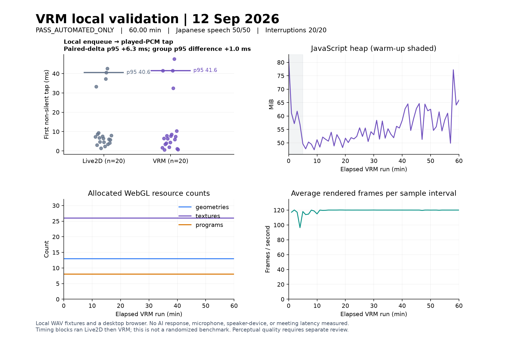

# Validation and known limits

Release review: **September 12, 2026**. AI-meeting is a beta. The public entry point is an avatar/audio demo; real AI conversation requires a configured provider in a self-hosted installation.

## Source checks

The final source verification passed **1,025 tests across 114 test files** and all workspace type checks. An earlier check on the same day passed 1,003 tests; that older count is the baseline for the avatar integration report, not the final release count.

```sh
pnpm install --frozen-lockfile
pnpm typecheck
pnpm test
pnpm build:oss
```

`build:oss` checks the actual emitted browser assets and source maps, preserves runtime license texts, verifies the bundled VRM sample hash, and rejects excluded avatar runtimes and missing license evidence. This is a distribution check, not a measurement of a cloud provider's availability or response speed.

## Local VRM and audio checks

These checks used local WAV fixtures with the real renderer, audio runtime, and wLipSync WASM. Their result is **PASS_AUTOMATED_ONLY**.

| Check | Observed result | What it establishes |
| --- | --- | --- |
| Japanese fixture speech | 50 / 50 passed | The supplied samples exercised local speech playback and the WASM lip-sync path. |
| Playback interruption | 20 / 20 passed; no stale captions or gestures | The local interruption path stopped playback and cleared the tested state. Maximum observed local stop time was 1.1 ms. |
| Local continuous run | 60 minutes; 127 / 127 periodic speech events passed | The visible renderer kept progressing, resource counts stayed stable, and cleanup closed the audio context and removed media/canvas elements. |
| Paired renderer timing | p95 of VRM minus Live2D: **+6.3 ms**, 20 paired samples | Additional local enqueue-to-played-PCM delay for the same audio fixtures. **This is not AI response time.** |

The timing run used the first 700 ms of each WAV with the same SpeakerOutput settings, in separate sequential Live2D and VRM blocks. Percentiles use nearest rank. Individual renderer p95 values were 40.6 ms and 41.6 ms; their difference, 1.0 ms, is a different statistic from the paired-difference p95 of 6.3 ms. This was not a randomized comparison, a microphone-to-speaker measurement, or a meeting latency benchmark.



The [machine-readable local summary](validation-assets/vrm-local.json) records the measurements and their scope. The [validation harness](../scripts/avatar/vrm-validation-server.mjs) is included; its original generated audio fixtures are not shipped.

## Recorded Gemini task demonstration

A **46.27-second** local recording used the actual SessionController, Gemini Live provider, TaskLedger, SpeakerOutput, and VRM renderer. One provider connection produced audible assistant responses. The recorded run added two tasks, interrupted during assistant playback, updated the saved task state, and read back the resulting state. No pending task proposal remained at the end.

The final state was `資料確認` (review materials) → `done`, due `今日` (today), and `メール返信` (reply to email) → `deferred`, due `明日` (tomorrow). These are authored demonstration tasks, not customer records or an external Google Tasks integration.

Important details of this demonstration:

- The user-side input was synthesized with the macOS Kyoko voice. It was not a person speaking live into a microphone.
- Assistant speech, transcripts, and task-tool responses came from the connected Gemini session. The avatar used the separately licensed pixiv VRM sample.
- The video uses a dedicated recording layout, not the normal application's screen layout.
- The runtime requested confirmation for the update. The recording script compared the proposed task titles, statuses, and deadlines against the disclosed synthetic input, showed the pending proposal, and invoked the actual `resolveTaskProposal` confirmation action. It did not directly rewrite the task state. This demonstrates the confirmation flow with a script; it is not evidence of unaided human approval or every voice command being applied automatically.

See the [recording helper and reproduction instructions](../scripts/launch/README.md). Completion of an arbitrary recording does not mean its task operations passed: the helper saves separate observation flags and refuses to confirm mismatched proposals.

## Not established by these checks

- Human judgments of conversational naturalness or Japanese lip-sync accuracy.
- A 60-minute live AI conversation, provider-wide availability, or an AI end-to-end latency percentile.
- Audio/video received by another real participant in Meet or Zoom. Meeting connectors need their own credentials, setup, and call validation.
- Production success for every optional provider or avatar integration. Gemini success does not establish GPT-Live, Anam, or meeting-bot success.

The short live demonstration and the 60-minute local fixture run are separate measurements. Neither alone completes a commercial-quality acceptance gate. Report reproducible problems through the repository; keep credentials and private meeting material out of public issues.
